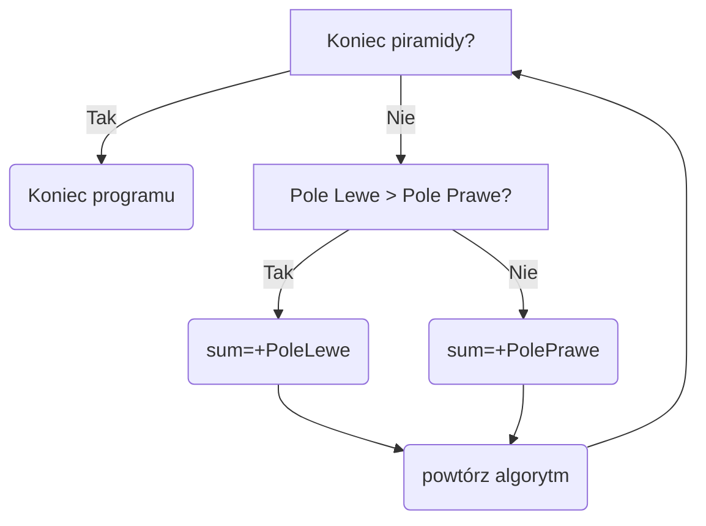
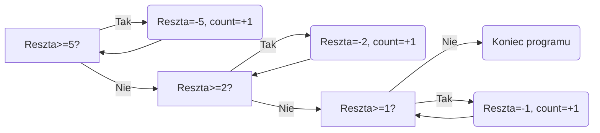

# Algorytmy Zachłanne
## Definicja
***Algorytm zachłanny*** - algorytm który w każdym kolejnym kroku dokonuje wyboru lokalnie optymalnego. Rozwiązanie zachłanne zawsze wybiera najlepszą z dostępnych opcji nie sprawdzając dalszych możliwości, co czasem powoduje uzyskanie rozwiązania nieoptymalnego globalnie
## Zasada działania algorytmu zachłannego
Algorytm zachłanny zawsze wybiera najlepszą lokalnie możliwą opcję, można to łatwo zaprezentować na przykładzie piramidy

Algorytm zaczyna na samym szczycie piramidy wybierając jedno z pól znajdujących się bezpośrednio pod nim. Nasz algorytm otrzymał za zadanie znaleźć największą sumę wartości w poniższych polach. Zasada działania algorytmu wygląda tak:

***
***Zad1.1***
Podaj sumę którą obliczy nasz algorytm.
***

Suma wynosi ==19==
***
***Zad1.2***
Czy otrzymana suma jest największą możliwą wartością?
***
### Probem naszego rozwiązania
W przedstawionym roziązaniu problemu wykorzystano algorytm zachłanny, który wybierając rozwiązania optymalne lokalnie, nie uzyskał rozwiązania optymalnego globalnie
**Rozwiązanie zachłanne daje nam wynik ==19== kiedy rozwiązaniem optymalnym jest wynik ==26==**


## Problem wydawania reszty
Problem wydawania reszty jest ciekawym zastosowaniem algorytmu zachłannego, ponieważ to, czy otrzymamy rozwiązanie optymalne globalnie zależy od otrzymanego zestawu nominałów. Aby nasz przykład był prosty i dawał nam optymalne rozwiązania przyjmijmy że nominały którymi dysponujemy to 1$ 2$ i 5$.

Algorytm na wejściu przyjmuje tylko jedną wartość jaką jest reszta do wydania, na wyjściu otrzymujemy ilość monet użytych do wydania reszty

 ***
***Zadanie 2.1***
Mamy do wydania resztę 13 $, jaka jest najmniejsza liczba monet które należy użyć, aby wydać tą resztę?
***
### Przykładowa implementacja rozwiązania
```python
def change():  
  
    # User input  
  try:  
        Change = int(input("Enter change: "))  
        n = int(input("Amount of different coins: "))  
        Coins = []  
        for a in range(n):  
            Coins.append(int(input(f"Value of coin {a + 1}: ")))  
    except:  #If user input is other than number
        print("Something went wrong, make sure you used correct values and try again")  
        exit(1)  
  
    Coins.sort(reverse=True) #Sorting our coins descending
  
  i = 0  
  counter = 0  
  
  if(Coins[0]>Change):
        print("Coins values are greater than change, giving change is impossible")  
        exit(1)  
    while Change > 0: #counting coins  
  while Change >= Coins[i]:  
            Change -= Coins[i]  
            counter+=1  
  i += 1  
  
  print(f"Required amount of coins:{counter}") #result  
  
if __name__ == '__main__':  
    change()
```
***
***Zad2.2***
Sprawdź co się stanie po wprowadzeniu wartości:
Reszta=30
Nominały=21,10,1
Czy powstałe rozwiązanie jest rozwiązaniem optymalnym?
***
***Zad2.3***
Dodaj możliwość wyświetlenia jakie nominały zostały użyte do wydania reszty
***
***Zad2.4***
Jeżeli nasz algorytm nie jest w stanie wydać reszty z powodu niedostępnych nominałów otrzymujemy błąd, dodaj proste zabezpieczenie w przypadku gdy wydanie reszty jest niemożliwe
***
## Inne przykładowe zastosowania algorytmów zachłannych

- optymalizacja zasobów (np. problem plecakowy)
-   nawigacja i znajdowanie najkrótszej ścieżki (np. algorytm Dijkstry)
-   kompresja danych (np. kodowanie Huffmana)
-   harmonogramowanie zadań (np. problem najwcześniejszego terminu)

